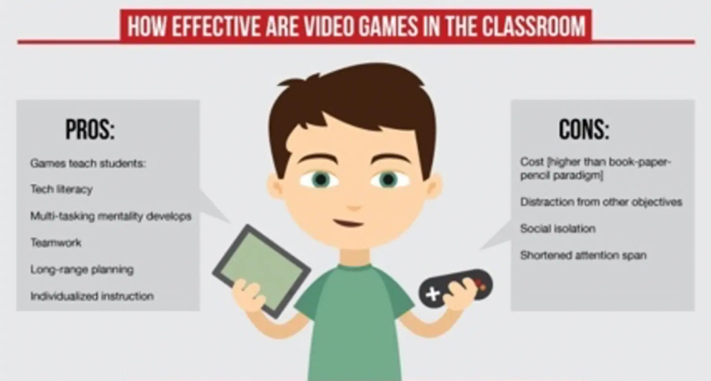

# Digital Game Based Learning
an introduction

## Definition

Game based learning (GBL) is a type of _game play_ that has _defined learning outcomes_. 
**Digital** game based learning (DGBL) refers to using actual digital video games as learning tools.

## Engagement
Engaging students in classroom content is always a hard task, and traditional forms of education have become expected and somewhat redundant, that the learning capacities of students are very weak. When students aren’t engaged, they’re more likely to disrupt class, less likely to accept challenges, have lower grades, and aren’t confident in their ability to learn.

Additionally, sustaining engagement is very important to ensure that the student is gaining the most out of their learning experience and that their **cognitive skills are always stimulated**. Engaging through educational video games that are built on educational content has proven to be a great way not only to keep students engaged but also to deliver complex theories/topics in an interactive manner allowing students to have a **deeper comprehension of the content**.

> Game-based learning and video games provide much more learning opportunities than expected.

#video [Using Games in the Classroom](https://youtu.be/o6IELVV2xLQ)

<iframe src="https://www.youtube.com/embed/o6IELVV2xLQ"></iframe>

#quiz Preliminary survey on [Game Based Learning](1000%20quiz_GBL.md)

## What is game based learning?

Designing more engaging curriculum we need to include techniques that teaches students how to be **critical**, **confident** and **creative** as well as abilities that they will need for success in the **work-a-day future life**. Many schools have adopted game-based learning, a pedagogical approach that involves **designing learning activities through video games where the game characteristics and game principles inhere within the learning activities themselves**.

For example, in an Economics course, students might compete in a virtual stock-trading competition, in a science class, students learn about genetics through *Geniventure*, a dragon hereditary game. There are many forms of game-based learning, including introduction of badges, leaderboards, and educational video games. Our focus here is educational video games and how they can be utilized to enhance curriculum development and student content comprehension.

**Gaming is inherently motivating**, which may allow learners to gain skills and knowledge, by leveraging entertainment and weaving it within learning environments. Research studies indicate that video games in particular have great engagement and education related benefits. 

#video [# Games and the Future of Education](https://www.youtube.com/watch?v=BiK2MPeg8k4)

<iframe src="https://www.youtube.com/embed/BiK2MPeg8k4"></iframe>

## Video Games and new teaching method

Recent studies have shown that introducing educational video games and adopting a game-based learning teaching approach, has helped students achieve better learning performance, improved student **engagement**, promote **motivation** and **active processing** of educational content.

Introducing video games into the classroom **enhances many learning and teaching skills** that can help elevate the educational experience of the classroom. This teaching method uses beneficial aspects of video games to transmit knowledge to students. It is based on **three key factors**:

1. It **breathes life into education**: it transforms learning into an enjoyable, thrilling game without boring lessons. Students assimilate and retain information almost without noticing.
2. It **boosts motivation**: students are the main characters in the story and their success is rewarded with medals, extra lives, bonuses, etc. This capture and keeps their interest in learning.
3. It gives **opportunities to practice** students can apply the knowledge they acquire without getting into dangerous situations. This is what flight and navigation simulators, for instance, are all about.

### How effective are video games in the classroom?
PROS:
- Games teach students
- Tech Literacy
- Muti-tasking mentality develops
- Teamwork
- Long-ange planning
- Individualised instruction

CONS
- Cost (higher than book-paper-pencil paradigm)
- Distraction from other objectives
- Social isolation
- Shortened attention span

### Skills

Additionally, playing video games has a huge impact on the development of **cognitive**, **collaboration**, **creative problem solving**, and **communication skills** of students. 

As well as improving learning abilities, there are other benefits. Here are some of them:

- They **speed up response times**: Researchers at Rochester University have found that they improve troubleshooting skills by posing problems that must be solved in a set time.
- They **encourage teamwork**: According to the Californian organization, the Institute for the Future (IFTF), multiplayer games boost teamwork in problem-solving.
- They **stimulate creativity, focus, and visual memory**: The University of California has found that they stimulate these aspects by setting goals that require concentration, imagination, and remembering details to achieve them.
- They **improve strategy and leadership**: Video games put players in command, honing their abilities to resolve disputes, interact with other players and make decisions, found Pittsburgh University.
- They **teach languages**: Helsinki University found that they are useful for learning other languages through on-screen instructions, chats for communicating with other players, or the narration of the story itself.
- **Critical thinking**: Monterrey Institute of Technology published an article underlining the underlying ethical, philosophical and social basis of these games, and their ability to make players think and improve their critical thinking.

You can read the [Appendix - Cognitive Skills](90%20appendix%20-%20Cognitive%20Skills.md) for more details.

### Moderation
The impact of video games on society has been the subject of numerous studies. For example a psychologist at the Internet Institute at Oxford University, published a study establishing how much time should children be allowed to devote to video gaming. He reports that those who played less than an hour were more emotionally stable, while those who played for around three hours a day developed social problems. Therefore, when it comes to video games, **moderation is key**. 

## Unit review
Now that we have established what is game-based learning and why using educational video games is beneficial, please respond to the following questions:

- Create your own definition of game-based learning
- How do you believe educational video games would support your pedagogical approaches and enhance your teaching methods?
- How would you introduce educational video games in your classroom?
