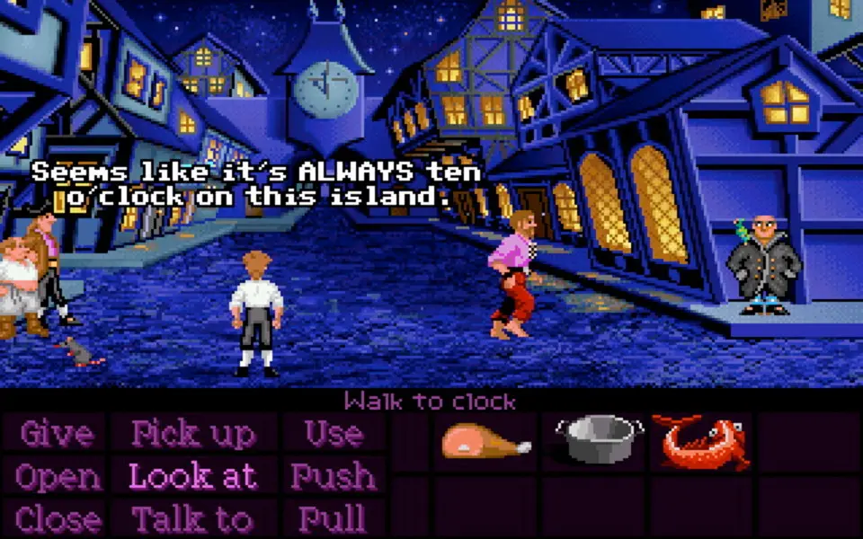
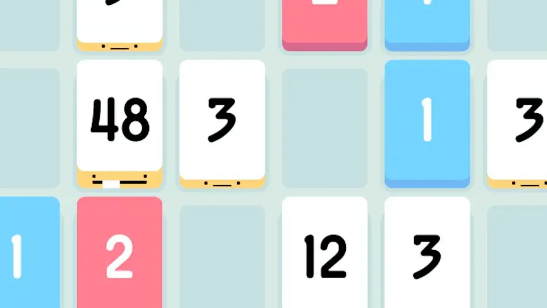
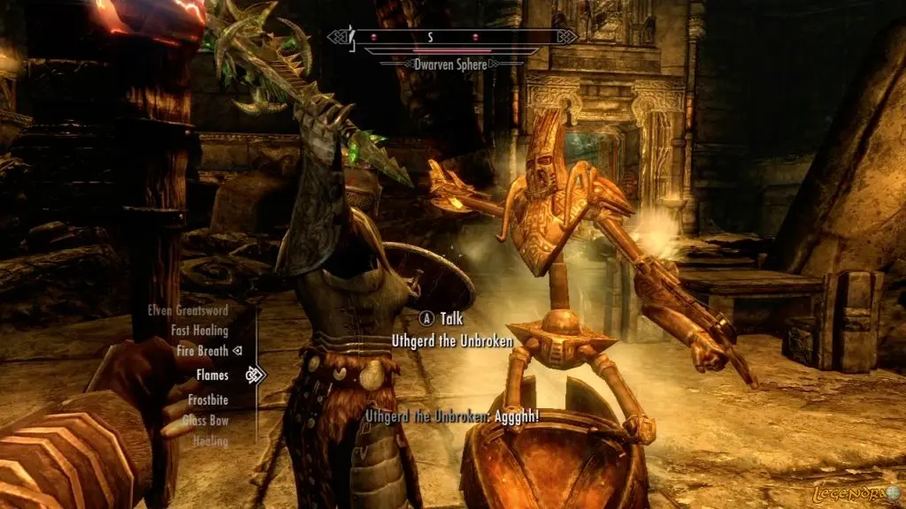
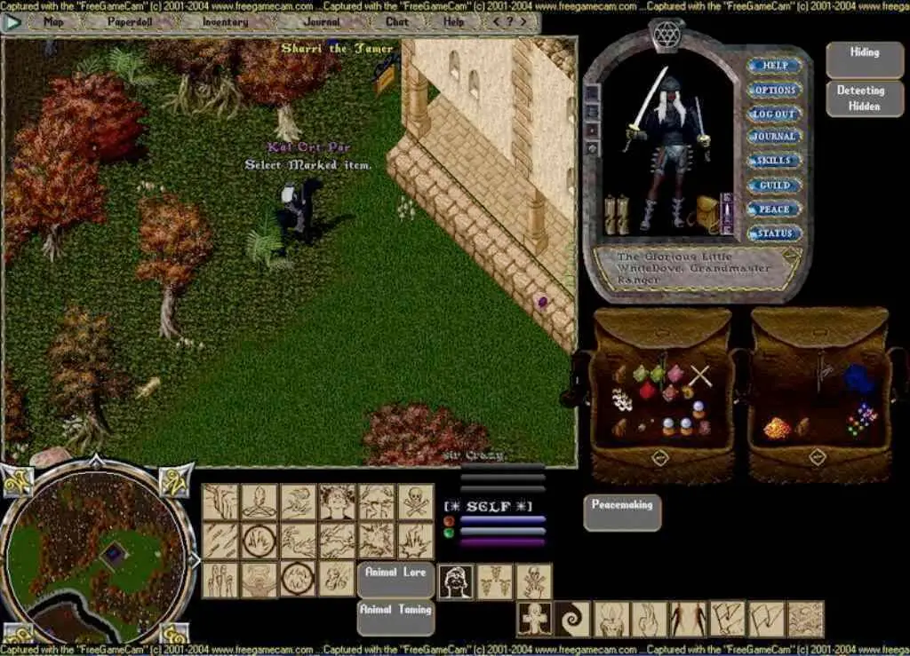

# Identifying Types of Digital Games for Learning

>  Learning Objectives: learn to identify the different types of digital game available, discusses those that are most appropriate for different types of learning in higher education, and presents two emerging areas in educational gaming.

### What we can learn with VG
Today we can find videogames that can help in quite every learning field.
For example:

- Language Learning
- Mathematics and Science (STEM)
- Social Studies and History
- Development of Cognitive Skills
- Rehabilitation

## Types of Digital Game Available to Educators
Many researchers have tried to categorize computer games into types or taxonomies, and although there are often large differences between them, there is also much similarity in terms of the general classifications. Here is a try to group them in general categories.

## Adventure
Adventure games are one of the oldest forms of computer game, going back to the early text adventures and interactive fiction of the 1970s and 1980s. They involve the player undertaking series of tasks or puzzles in which they must interact with the virtual world, performing actions, talking to characters and manipulating objects in order to achieve the objectives of the game, often to solve some mystery or complete a quest.

Although the original adventure games were text-based, contemporary commercial adventure games tend use graphics, offering three-dimensional worlds that players can navigate. There is also a growing popularity of simpler web-based adventures, known as point-and-click games, which typically provide two-dimensional environments in which the player has to navigate through rooms and make objects interact to solve the puzzles presented

Adventure games generally depend on **mental agility** rather than physical dexterity and tend **not to be time-dependent**. Some adventures combine elements of both and it is common for adventure games to contain mini-games in another genre. In terms of education, adventure games can **present a context for problem-solving and lateral thinking**, where players have to work out the appropriate actions in order to achieve a goal.

**Examples**

#### The tale of Monkey Island

#### Myst

#### Horizon Zero Dawn

#### Zelda

## Platform
Platform games involve the movement of the player character through a landscape (usually two-dimensional), jumping up and down between platforms, avoiding obstacles and enemies, and picking up treasure, usually with some overall goal in mind and often in the context of a narrative. Platform games require physical dexterity and the aim is usually to score points and complete levels.
The types of skills that they develop are **hand–eye coordination**, **planning** and **strategizing, problem-solving** (the sequence of steps required to get over a particular obstacle for instance) and the ability to think quickly.

#### Braid

#### Limbo

#### Super Mario Maker 2

## Puzzle
Puzzle games primarily involve problem-solving, can take many forms – including words, logic, mathematics – and are often based on traditional puzzles (for example online crosswords or spot-the-difference). Simple puzzle games can be stand-alone but they are also often embedded within a larger narrative structure so that solving the puzzles will complete some larger quest or story. It is common for puzzles to be embedded within other genres such as adventure games as mini-games. Puzzles can be used to support a variety of **different types of learning** depending on the type of puzzle, including **logic**, **spatial awareness**, **verbal skills**, **numeracy skills**, and **spelling**. I would also include quizzes in this category, and they are an example of a game activity that can be used in almost any area of a curriculum, but primarily for recall of facts.

#### Threes!

#### Ruzzle

#### Monument Valley

#### The Room

#### Portal

## Role Play
Role play games emerged from the face-to-face role-playing games and involve the player taking on the role of a character in another (usually fantasy-based) world.
The player can undertake a range of activities including solving quests, fighting, treasure hunting, and interacting with other characters (either other players in the game world or non-player characters). There is usually a mix of problem-solving skills required as well as strategy and sometimes physical dexterity, and although single-player role-playing games exist, they are commonly multi-player. Role play games are usually underpinned by complex statistical models that provide scores for a range of characteristics that determine a character’s abilities and weaknesses.
In the context of learning, role-playing games are good for providing a context for building **collaborative skills**, **social interaction**, **negotiation**, **management of complex systems** (e.g. character statistics), **strategy**, and working through scenarios.

#### Final Fantasy serie

#### The Elder Scrolls V: Skyrim

#### Ultima

## Shooter
Shooter games have the primary aim of using weapons (or sometimes spells and other special abilities) to defeat opponents, although the action is often embedded within a wider narrative context. They are generally played from a **first person** viewpoint (FPS First Person Shooter) and are played in real time. This is another genre in which **multi-player** games are common. Shooter games involve a combination of strategy and dexterity, exploring virtual worlds and defeating enemies and targets.
Although this is one genre in which it may be argued that there is less applicability to learning in higher education, there are still many skills that can be acquired by playing such games including forward **planning**, **strategizing**, and **team working**.

#### DOOM

#### Call of Duty

#### Fortnite

## Sports
Sports games allow the player to simulate taking part in a sporting event or tournament. They are generally based on physical dexterity and interaction with the gaming interface, but in recent years innovations such as dance mats and consoles that use movement-sensitive devices (the most notable example being the Nintendo consoles) have enabled players to actually undertake physical activity while playing.
Sporting games can be used to **practice** the actual skills of a sport (although in the majority of cases this will be a representation through whatever interaction device is available), **tactics**, **rules** and the ability to **think and make decisions quickly**.

#TODO Some images of sport games

## Strategy
Strategy games involve the player making strategic decisions within a scenario in order to meet the goal of the game, which is usually completing a level or solving a particular problem. They can involve, for example, movements of armies, progression of a group through various stages of development, management of resources or creation of environments to achieve specific purposes. For example, the strategy game Age of Empires involves players progressing their empire through stages of civilization. Many strategy games also have elements of **simulation** built into them in terms of a complex underlying model of a virtual environment, but will tend to have clear goals.
Strategy games can be used for teaching **planning**, **decision-making**, **testing hypotheses**, **strategic thinking**, **management skills** and **seeing the consequences** of actions taken.

#TODO Some images of strategy games

## Casual games
Another type of game (which isn’t really a genre in itself as there are many different types) that is currently growing in popularity is casual games. These games are usually downloaded from gaming sites rather than being available in shops and are cheaper than traditional entertainment games (or free to play online).
Casual games are designed to be played in **short bursts** rather than for prolonged sessions so are **chunked into many small levels** that all follow the same pattern, so that they can be played for a few minutes at a time and easily stopped and restarted. These games cater for players who simply want to play a game for a short time and do not want to make any great commitment in terms of time or learning how to play. They have **simple game play** and comparatively low production values. The rise in the use of casual games shows a movement away from the typical ‘hardcore’ gamer to a wider demographic, particularly female and older players, which is more typical of the whole university student demographic, and casual games may be most appropriate for fitting into specific segments of teaching time.

#### Fancade

#### Dumb Ways to Die

## Chapter Navigation
[Go to Previous Chapter](40%20types%20of%20digital%20games.md)
[Go to Next Chapter](50%20coach%20guide.md)
