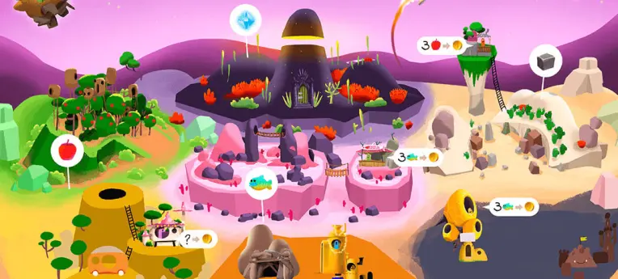
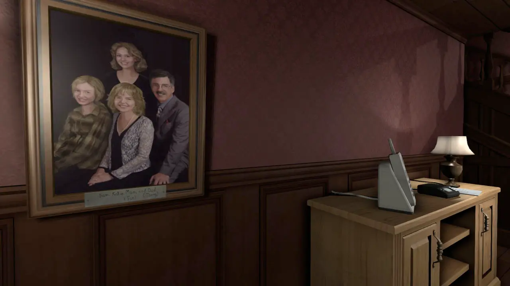
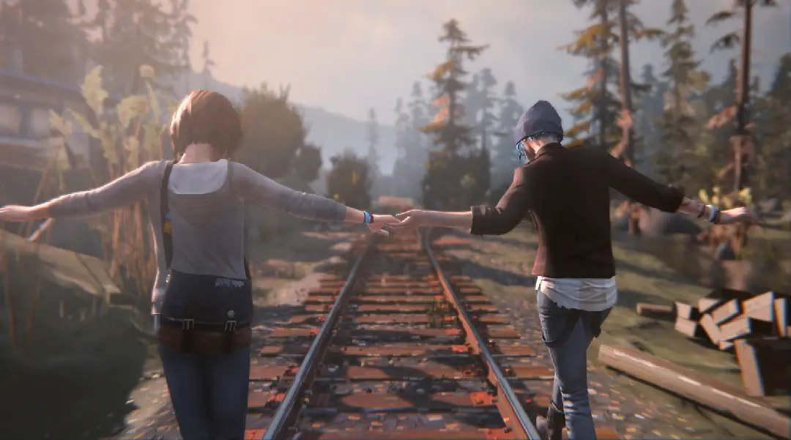
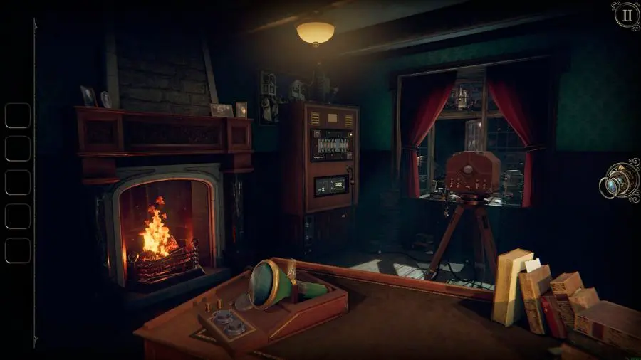
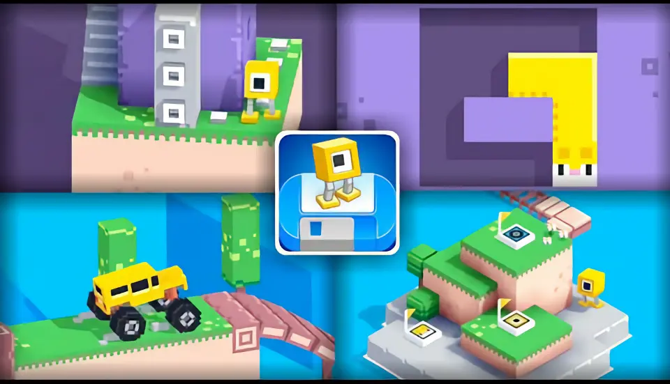

# 4. Case Studies

**Learning Objectives**  

- Which existing videogames can we use?
- What can we learn using commercial videogames?

## Educational games

### Antura & the Letters

The educational goal of the game is to help players to acquire the basics of Arabic literacy, including Arabic letters, reading comprehension, and some vocabulary. But the game also has a social well-being objective to support flow, engagement, and motivation

> **Curricular connections**: Language learning; Arabic literacy; social and emotional learning 
> **Possible skills taught**: Recognizing letters (shapes, names, phonemes); syllables and word reading; vocabulary

website: [antura.org](https://www.antura.org)

### Dragon Box

Through playing with the digital manipulatives in *DragonBox games*, students deeply understand the mathematical concepts through active engagement, all while learning at their own pace.  Each of our games are based around “digital manipulatives”.  These digital manipulatives were designed to be used as a teaching tool, along with classroom instruction and discussion.  
Website: [dragonbox.com](https://dragonbox.com/)

### Dumb Ways to Die

An Australian public campaign made by Metro Trains in Melbourne, Victoria, Australia, to promote railway safety.   
Website: [dumbwaystodie.com](http://www.dumbwaystodie.com)

### iCivics

**iCivics** exists to engage students in meaningful civic learning. We provide teachers well-written, inventive, and free resources that enhance their practice and inspire their classrooms. about. **iCivics** reimagines civic education for American democracy.  
Website: [icivics.org](https://www.icivics.org)

### Other titles
- [Ludwig](http://www.playludwig.com) - educational game for physics
- [80 Days](https://www.inklestudios.com/80days/) - adaptive educational game for geography
- [Roma Nova](https://www.irit.fr/~David.Panzoli/romanova.html) - teaching history with brain interfaces
- [Bionigma](https://www.gcc.tu-darmstadt.de) - science game for protein exploration
- [Meister Cody](https://www.meistercody.com) - educational game for dyscalculia
- [Orwell: Keeping an Eye on You](https://www.osmoticstudios.com/orwell-keeping-an-eye-on-you/) - learn personal information data management

## Health

### The Game that can give you 10 extra years of life

Game designer Jane McGonigal firmly believes that video games are not just about mashing buttons and getting to the next level. In fact, during her talk at TEDGlobal 2012, McGonigal gave several surprising statistics: that online gaming can be more effective than pharmaceuticals in treating **clinical depression** and that just 30 minutes a day is correlated with significant **increases in happiness**.

📽 #VIDEO [The game that can give you 10 extra years of life](https://www.ted.com/talks/jane_mcgonigal_the_game_that_can_give_you_10_extra_years_of_life)
<iframe width="937" height="527" src="https://www.youtube.com/embed/lfBpsV1Hwqs" title="The game that can give you 10 extra years of life | Jane McGonigal" frameborder="0" allow="accelerometer; autoplay; clipboard-write; encrypted-media; gyroscope; picture-in-picture" allowfullscreen></iframe>

### Some titles
- [Re-Mission](https://hopelab.org/case-study/re-mission/) - help young cancer patients with treatment compliance
- [Zombie Run](https://zombiesrungame.com) - Run in the Real World. Become a Hero in Another.
- [Play Forward](https://www.play2prevent.org/our-games/playforward-elm-city-stories/) - HIV prevention
- Respir Games (asthma therapy)
- BalanceFit (balance, coordination and strength training)
- [NEUROvitalis](https://www.headapp.com/en/neurovitalis-en/) - personalized cognitive training
- KickAss (autism game for adolescents)
- [Zirkus Empathica](https://www.zirkus-empathico.de/) - autism game for children
- [SPARX](https://www.sparx.org.nz/home) - mental health game for youths & adolescents

## Empathy

> The ability to identify with or understand another's situation or feelings

### This War of Mine

This War of Mine is a war survival game that differs from most war-themed video games by focusing on the civilian experience of war rather than front line combat. Characters have to make many difficult decisions in order to survive everyday dangers. There are various endings for each character, depending on the decisions made in the game.  
Website: [thiswarofmine.com](http://www.thiswarofmine.com)

### Papers, Please

**Papers, Please** is a single-player “Dystopian Document Thriller” in which the player steps into the role of an immigration inspector in the fictional country of Arstotzka in the year 1982. As the player stands on the threshold between two different countries, a unique perspective of immigration and border security springs out of the mundane task of inspecting papers. On a second layer, the player must simultaneously provide for their family using the salary earned from the job, which pays based on how many people have been processed through in a day. Balancing border security with the needs of the family is uniquely human, creating a juxtaposition that is new and interesting.  
Website: [papersplea.se](https://www.papersplea.se/)

### Bounden

**Bounden** is a smartphone dance game that gets players to use their bodies. Two people hold opposite ends of one smartphone then move together to keep a cursor over the ball. What starts as a novel way to interact with the game slowly encourages the two players to move creatively together as they complete each level.  
website: [playbounden.com](http://playbounden.com)

## Ethics
> Ethics is the art and science of analysing issues of good, bad, right, wrong, just, and unjust.

### PeaceMaker

A government simulation game which simulates the Israeli–Palestinian conflict.   
Website [peacemakergame.com](http://peacemakergame.com)

### Phone Story

Phone Story is a game for smartphone devices that attempts to provoke a critical reflection on its own technological platform. Under the shiny surface of our electronic gadgets, behind its polished interface, hides the product of a troubling supply chain that stretches across the globe. Phone Story represents this process with four educational games that make the player symbolically complicit in coltan extraction in Congo, outsourced labor in China, e-waste in Pakistan and gadget consumerism in the West.
http://phonestory.org

### Unmanned

Most video shoot-em-up video games make war seem action-packed and glamorous. Unmanned aims to paint a far more realistic portrait, casting players as a soldier dealing with boredom and traumatic dreams, in addition to military duties.
http://unmanned.molleindustria.org

### Data Dealer
Data Dealer is an online game about collecting and selling personal data - full of irony and gleeful sarcasm. It'´'s a browser/serious/edu/impact game about digital culture and surveillance and aims to raise awareness about online privacy in a new and fun way.

https://datadealer.com

### Half the Sky Movement

The Game is a game-based adventure that aims to reach mainstream audiences to raise awareness and donations to empower women and girls around the world.

http://www.halftheskymovement.org

### Fate of the World

Fate of the World is a dramatic global strategy game that puts all our futures in your hands. The game features a dramatic set of scenarios based on the latest science covering the next two centuries. You must manage a balancing act of protecting the Earth's resources and climate versus the needs of an ever-growing world population

https://www.soothsayergames.com

## Other games for social good

**World Without Oil**  
Also a McGonigal creation, players in this game are dropped into a world where oil resources have been tapped and where they must get creative to survive the massive global shortage. The best part of the game? It teaches easy ways to use less oil in the real world—habits that players report keeping up when they aren’t playing.  
[website](http://www.worldwithoutoil.org)

**FoldIt**  
An online protein folding game, FoldIt allows its quarter million players to help with scientific research by stabilizing strings of amino acids. Think of it like biological Tetris — FoldIt makes a competition out of biological pattern recognition, leading to innovative solutions to problems that have frustrated scientific communities for years.  
[website](http://fold.it/portal)

**WAY**   
Communicating across languages and cultures isn’t easy. But in this online game, two anonymous players — culled from different locations around the globe — must learn how to speak to each other as they navigate obstacles. Developed by CoCo & Co, this game took top honors at this year’s Games for Change Awards.  
[website](http://www.makeourway.com/)

**Budget Hero**    
Think you could balance the national budget? Then you’ll want to play this game from American Public Media, which lets players see what happens to the national deficit when they increase funding to programs or opt to make difficult cuts. “Every member of Congress should be required to play this game,” said one of its creators.  
[website](http://www.marketplace.org/topics/economy/budget-hero)

**Pain Squad**  
Children and teenagers with cancer are often asked to keep pain diaries — paperwork that is not only boring but focuses their attention on their discomfort. The iOS app Pain Squad makes the whole process fun and interactive — while also helping doctors provide better treatments for young patients.  
[website](http://www.campaignpage.ca/sickkidsapp/)

**Spent**  
When your bank account is in the black, it’s easy to think that anyone could pull themselves out of poverty by their boot straps. But in this online game, players are charged with looking for work while surviving on $1000 a month — highlighting that poverty and unemployment are systematic and not just the result of character flaws.  
[playspent.org](http://playspent.org/)

**Evoke**  
Created by the World Bank Institute in conjunction with McGonigal, this game is a 10-week crash course in social innovation, giving players challenges from “food security” to “urban resilience,” and encouraging them to become a think tank on local challenges.  
[www.urgentevoke.com](http://www.urgentevoke.com)

## Training and simulation

📽 #VIDEO [Build better cities with games](https://www.ted.com/talks/karoliina_korppoo_how_a_video_game_might_help_us_build_better_cities/)
<iframe width="937" height="527" src="https://www.youtube.com/embed/qYUmI5kGsYk" title="How a video game might help us build better cities | Karoliina Korppoo" frameborder="0" allow="accelerometer; autoplay; clipboard-write; encrypted-media; gyroscope; picture-in-picture" allowfullscreen></iframe>

Some titles:
- [Democracy](https://positech.co.uk/democracy/) - political strategy game
- [Flight Simulator](https://www.flightsimulator.com)
- [Lost Earth 2307](https://www.iosb.fraunhofer.de/en/projects-and-products/lost-earth-2307.html) - image interpretation, military
- [Ship Simulator](https://www.shipsim.com) - Maritime Search and Rescue
- [SchaVIS](https://www.youtube.com/watch?v=xMvV7oOJozw) - flooding simulation and prevention
- [Sharkworld](https://www.xmediaworks.nl/en/portfolio-items/sharkworld-a-project-management-game/) - project management training
- [Houthoff Buruma](https://annex.fandom.com/wiki/Houthoff_Buruma_The_Game) - recruitment and assessment

## Commercial games
For the selected games we try to extract the **curricular connections** (learning topics) and the **possible skills taught**.

## Adventure

### Gone home

A first-person exploration game where the player plays as Kaitlin Greenbriar, a student returning from a trip abroad. Most disconcerting is the whereabouts of Kaitlin’s younger sister Sam who has vanished, though not without a trace. To help determine what happened to Sam, the player must follow clues and journal entries to uncover numerous secrets hidden throughout the house.

> **Curricular connections:** English language arts; narrative studies; social and emotional learning; media literacy  
> **Possible skills taught:** Environmental storytelling; character development; genre; linear vs. nonlinear narrative; game mechanics and narrative; intertextuality; perspective-taking

### The walking dead

The Walking Dead tells the story Lee Everett, a teacher from Atlanta caught right in the middle of a zombie apocalypse. During the game, the player plays as Lee through the trials and challenges that he and other survivors have to overcome. The gameplay is fairly straightforward, consisting mostly of controlling Lee to explore his surroundings and choosing his dialogue lines in conversation with other characters. As part of this, the player needs to act on Lee’s behalf in difficult, complex moral dilemmas.

> **Curricular connections:** Moral philosophy; ethics; social norms, history of ideas  
> **Possible skills taught:** Decision making; systems thinking; higher-order thinking skills, such as cause and effect; critical thinking; reflection; game-to-self connections; game-to-world connections; mindfulness

Tips:
1. Teachers should play the episode they will be using at least twice, as deep knowledge of the game is crucial to make the necessary curricular connections.
2. Teachers should encourage students to base their arguments on ethical theories, and not just their “gut feeling.”

### Life is Strange

The player takes on role of the female character Max Caulfield, an eighteen-year-old photography student, who tries to save the people of the town from a catastrophic tornado that might befall the Bay. Playing the game through a third person perspective, the player controls the character Max’s movements to explore the game environments, to uncover the game stories through Max’s involvement in various events, and to make life-changing decisions for Max based on choices offered by the game’s branching narrative.

The player confronts several challenging moral dilemmas that require the player to make decisions, which ultimately could benefit one character but could cause devastating consequences for another.

In addition, the player can undo consequences by activating the rewinding clock game mechanic to travel to prior timepoints, and by making different decisions that can shape future events.

> **Curricular connections:** Philosophy; ethics; logic; English language arts; social and emotional skills  
> **Possible skills taught:** Philosophical analysis; ethical analysis; narrative design; logical thinking; analyzing moral dilemmas; narrative design

### Assassin’s Creed (series)

The series comprises ten narrative-driven standard game chapters, each covering different chronological eras and locations, with a narrative arc that spans from Ptolemaic Egypt through the Holy Land at the time of the third Crusade; Renaissance Italy; the Americas in the Colonial Era; and the French Revolution. Gameplay is centered on open-world exploration, collecting hints and evidence and gathering or delivering information

> **Curricular connections**: World history; World cultures; arts; English language learning; language learning; history of art and architecture; colonial history; piratical history; music  
> **Possible skills taught**: art and architecture appreciation; music appreciation; task-based problem solving; listening and reading comprehension (ESL, foreign languages); ethical decision-making; argumentation; empathy; analyzing moral dilemmas

### The Legend of Zelda: Breath of the Wild

This game drops the player in a vast, open-world landscape, giving Link complete freedom to explore the game’s many locations as he takes on a plethora of adventures, monsters, and puzzles. Because the game encourages experimentation and exploration, each player can shape the story according to their own pace and skills.

> **Curricular connections:** Social and emotional skills; management  
> **Possible skills taught**: Focus, organization, time management; working memory; executive function

**Tips:** 
1. After the students play Breath of the Wild, teachers should ensure that they understand how the executive functioning skills were used in the game.
2. One way teachers can support reflection on skills used in the game is by encouraging students to write down specific examples of when success completion of quests required the use of each skill.

## Platform

### Braid

BRAID is a side-scrolling adventure. Each of the game's six worlds features a different **time-shifting game mechanic** that is used to decipher a series of **mind-bending puzzles**. Depending on the level and circumstance, time might slow down, enemies might move forwards or backwards depending on the direction in which our little blue-suited hero is running, or the clock may stop altogether. **Players can rewind time** as much as they like at any time and in any level.

### Never Alone

In Never Alone you play as a young Inupiat girl, Nuna, who goes off on a journey to discover the source of an eternal blizzard that is threatening to destroy her village. Along the way she encounters an Arctic fox and a series of spirit creatures who aid her in her journey. Never Alone is a puzzle platformer in which the player can either control both Nuna and her artic fox companion to solve a series of puzzles that require an understanding of how various Inupiat tools, environmental elements (e.g., wild animals and weather) and NPCs (usually in the form of Inupiat spirit creatures) work. 

> **Curricular connections:** Social studies; social and emotional learning  
> **Possible skills taught:** Systems thinking; collaboration; decision-making

### Super Mario Maker 2

## Puzzle

### Keep Talking and Nobody Explodes

Keep Talking and Nobody Explodes is a cooperative puzzle virtual reality (VR) game, where players must defuse a bomb in a specific number of minutes. The game places players in one of two roles, the VR player and the manual expert(s). The VR player wears a virtual reality headset while the manual experts access a separate resource called the bomb manual. Once the game starts, it transports the VR player into a window-less, police examination-style room with the bomb and some tools. Each bomb consists of a timer and a variety of modules containing complex symbols or sets of rules. The VR player can view, manipulate, rotate, and move the bomb and other objects in the room. In contrast, the manual expert cannot see the bomb but can peruse the bomb manual.

**Curricular connections**: Computer science; communication; English language arts; reading 
**Possible skills taught**: Logic; Problem solving; verbal communication; reading comprehension; teamwork

### Threes!

**Curricular connections**: mathematics 
**Possible skills taught**: Logic; Problem solving

### Ruzzle

**Curricular connections**: communication; reading 
**Possible skills taught**: Logic; Problem solving; verbal communication; reading comprehension; teamwork

### Monument Valley

Monument Valley is an MC Escher-inspired puzzle game that bends architecture and follows a silent princess through a captivating world. 
What makes this unique is the game's landscapes. Players can drag and turn parts of certain buildings to create a path from one area to the next. And, in others, stepping on trigger squares will change gravity and have you walking along the side of a wall. The game's physics is based on perception, so if you're able to position elements so there appears to be a path, you can use it, even if that path wouldn't exist in the real world.

### The Room

> **Curricular connections:** mathematics; social studies; art; media studies; computer science; psychology; sociology; anthropology; biology; chemistry  
> **Possible skills taught:** information literacy; quantitative reasoning; critical thinking; technological literacy; programming

### Portal 2

Portal 2 (Valve Corporation, 2011) is a sequel to the original Portal both of which are enormously popular first-person puzzle-platform games where the player moves around the environment by shooting starting and ending portals into otherwise disconnected surfaces, thereby creating a link through which the player may move objects, including themselves. The game requires **extensive spatial acuity** and was quickly recognized for its potential use for **learning physics, problem solving, and critical thinking**.

> **Curricular connections:** Physics, geometry, English language arts; social and emotional learning
> **Possible skills taught:** Communication skills; teamwork; problem-solving; critical thinking; logical thinking; spatial analysis; employment/career skills

{: .highlight }
> How to use Portal 2 in a STEM / Physics classroom: [read here](https://www.foundry10.org/programs/games-and-learning/portal-2)

## Role Play

### Final Fantasy serie

**Curricular connections:** Modern literature; science fiction; cultural studies; media studies, humanities; psychology; urban studies  
**Possible skills taught:** critical thinking, creativity, ethical judgment

### World of Warcraft

World of Warcraft (WoW) is one of the first and largest subscription-based massively multiplayer online role-playing games (MMORPGs) today. WoW offers players two factions (Alliance and Horde) who compete and collaborate to protect their world, Azeroth, against external and internal threats. Players can participate in a mix of activities such as **individual** and **collaborative** quests, gathering and crafting professions, raiding, battlegrounds, arenas, social and private text chat, and a combined open bid auction house. Players can also choose between individual gameplay, joining groups of up to 40 players, or joining guilds with 100s of members.

> **Curricular connections:** Accounting; business; supply chain management  
> **Possible skills taught:** Market research; financial statements; marketing; accounting spreadsheets; trading

### Deus EX - Human Revolution

An immersive cyberpunk environment with striking visuals, suspenseful storytelling and compelling characterization. The action shifts, as in cyberpunk novels, between mega cities or urban hubs. The game’s narrative and gameplay revolve around transhumanism.

**Curricular connections:** Modern literature; science fiction; cultural studies; media studies, humanities; psychology; urban studies  
**Possible skills taught:** critical thinking, creativity, ethical judgment

## Shooter

### DOOM

### Call of Duty

In the **single-player** campaign, the player takes on the roles of various characters, including a United States Marine and a British Special Air Service (SAS) operative. The player’s perspective changes dependent on the character and as the plot evolves through non-playable events and playable missions. Missions typically include objectives based around eliminating enemies, passing checkpoints, securing objectives against attackers or destroying an enemy location. In the **multiplayer** version, the series utilizes these mechanics for various team-based and deathmatch-based modes across various maps.

> **Curricular connections:** History; politics; international relations; ethics   
> **Possible skills taught:** Ethical decision-making; ethical design; analyzing moral dilemmas, narrative design

### Fortnite

Fortnite is an online action game published by Epic Games in 2017. It is set in a near future and adopts a third person perspective and cartoonish aesthetics. It includes three different modalities.

- Fortnite: **Battle Royale** mimics the PlayerUnknown’s Battlegrounds formula by presenting a ludic system where up to 100 players compete in one-versus- one or team-versus-team modes.
- Fortnite: **Save the World** is a cooperative survival experience where four players are asked to complete several missions against the game. Tasks span killing enemies, collecting materials, and building shelters for stopping armies of zombies.
- Fortnite **Creative** is a creative mode that provides several editing tools. Players can build and craft different structures and objects on personalized islands.

> **Curricular connections:** Critical theory; digital cultures; educational technology; social and emotional learning  
> **Possible skills taught:** Collaborative thinking; connectivist thinking; creativity; critical thinking; social media literacy

## Sports

### NBA2K14

**Curricular connections:** Social Studies; biomechanics; economics; biometrics; management **Possible skills taught:** Systems thinking; collaboration; decision-making; critical gaming vocabulary; critical thinking; historical awareness

## Strategy

### Civilization 

Players guide a civilization from the bronze age to the near-future competing against other humans or an artificially intelligent computer player, earning points for how powerful and advanced their civilization becomes. Before starting a game, players choose one of multiple civilizations to lead, each with unique gameplay abilities based on the circumstances or achievements of their real-life counterparts.

> **Curricular connections:** History; geography; civics; economics; sociology  
> **Possible skills taught:** critical thinking; experimentation; cost-benefit analysis; cooperation; inquiry- based learning

**Tips:**
1. Teachers should take time to learn the structure, controls, and mechanics of the game before introducing students to it.
2. Students might have some initial frustration when learning how to play.
3. Teachers can explore specific topics by creating their own custom game or scenario.
Hundreds of free player-made mods can be found online.

### Pandemic

Pandemic is a cooperative game where a team of players take on unique roles (e.g., medic, scientist, researcher) as members of a global health organization who are charged with combating disease outbreaks and ultimately, curing four contagions as they emerge around the planet. Players are confronted with a collective choice as to how to best deploy their individual resources to confront immediate health conditions or develop a long-term plan to cure each illness.

**Curricular connections:** Public policy; epidemiology; health; biology; social and emotional learning; information sciences  

**Possible skills taught:** Algorithm building; probability-based predicting; argumentation; rhetoric; collaboration; communication; advocacy; planning; decision making; logic

### SimCity

SimCity is a simulation video game with the main goal to develop a thriving city from small town beginnings. Players control the development of the city by defining development zones, installing technical infrastructure (e.g., traffic roads and water supply installments), and providing services (e.g., schools and fire departments). The type of development zones (industrial, commercial, or residential) determines the kinds of buildings that get automatically constructed in the zone. During the game, players must constantly ensure balanced development conditions, such as adherence to budgets and maintaining the satisfaction of citizens.

**Curricular connections**: urban and regional planning, urban development, urban geography, (governmental) policy making, technical infrastructure, environmental studies

**Possible skills taught:** systems thinking, system planning and control, system development, concept of sustainability

### This War of Mine

Unlike a typical war game where players usually assume the role of capable soldiers, this game puts the player into the shoes of a group of civilians who live in a besieged city trying to survive, aiming to promote empathy and awareness of real-world armed conflicts, and many believed it was achieved.

**Curricular connections:** Social and emotional learning; ethics; game design
**Possible skills taught:** Empathy; moral dilemmas; decision-making; narrative design
**Tips:**
1.  Game play can extend outside the classroom for a more complete experience.
2.  For a more advanced study, students can start the game with a weaker character profile—instead of the initial settings suggested in Figure 3—to challenge the player’s morality and decision-making skills.

## Casual games

### Fancade

Fancade is a huge collection of simple games. Play them instantly, or make your own game using drag-n-drop building blocks!
website: [fancade.com](https://www.fancade.com)

## Sandbox

### Minecraft

Minecraft is an open-world game, allowing players opportunity for unlimited exploration and creation. Gameplay takes place in a pixelated 3-D environment resembling a natural world with many different biomes (e.g. forests, tundra, and deserts). Every element of the world is made from blocks of corresponding materials. For example, trees are made from blocks of wood and ores in blocks of ore. Players can break apart and collect these blocks using their hands, or tools crafted in the game using found materials. Survival is the key objective of Minecraft, which is predicated on players’ ability to maintain both their own health and wellbeing.

**Curricular connections:** Foundational knowledge (English language arts, geography); meta-knowledge (cause and effect, narrative experience); humanistic knowledge (cultural competence)   
**Possible skills taught:** Writing; critical thinking; exploration; experimentation; cause and effect; mapping; building; design; creativity; resource management; communication

website: [minecraft.net](https://www.minecraft.net)

### Kerbal Space Program

Take charge of the space program for the alien race known as the Kerbals. You have access to an array of parts to assemble fully-functional spacecraft that flies (or doesn’t) based on realistic aerodynamic and orbital physics. Launch your Kerbal crew into orbit and beyond (while keeping them alive) to explore moons and planets in the Kerbol solar system, constructing bases and space stations to expand the reach of your expedition.  
website: [kerbalspaceprogram.com](https://www.kerbalspaceprogram.com)

---
## Unit Review
- describe a videogame you know and its curriculum connections and possible skills taught
