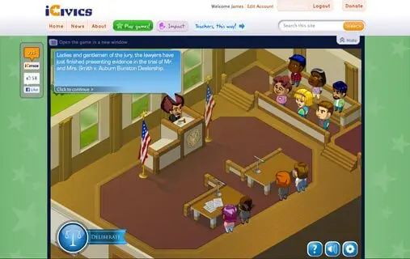
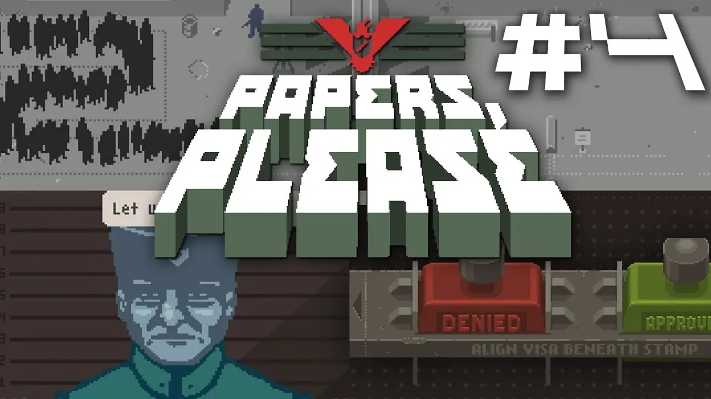
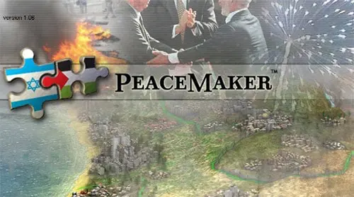
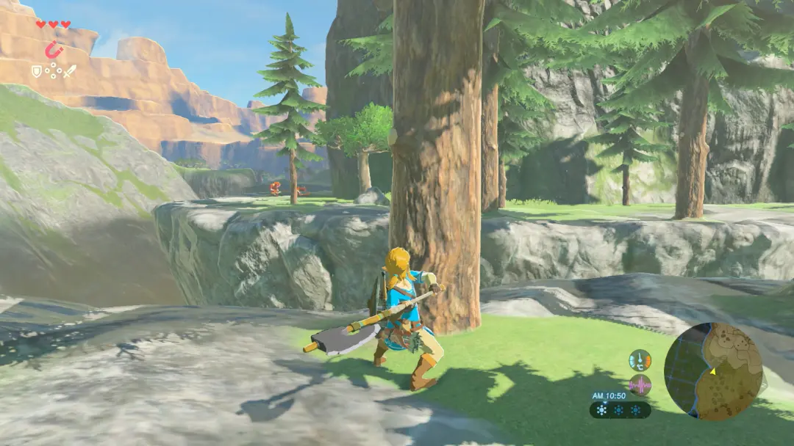
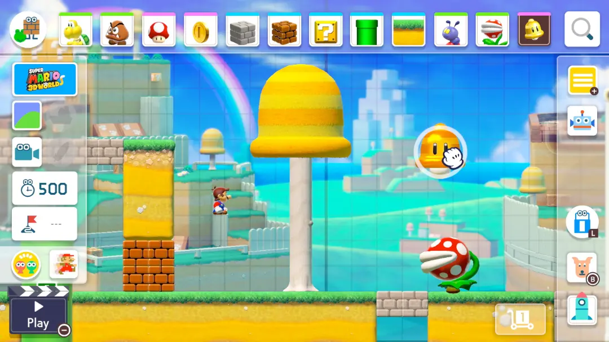
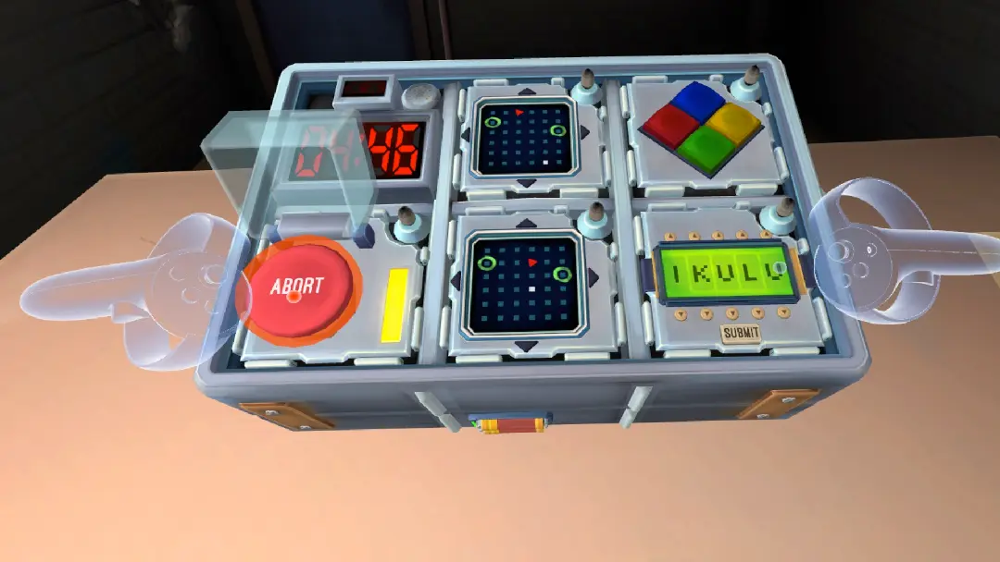
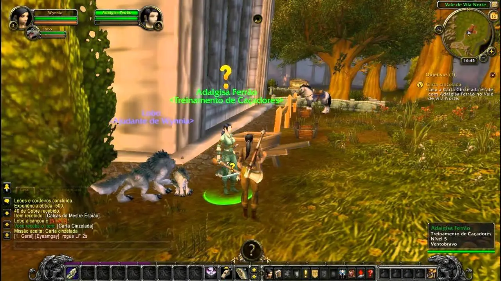
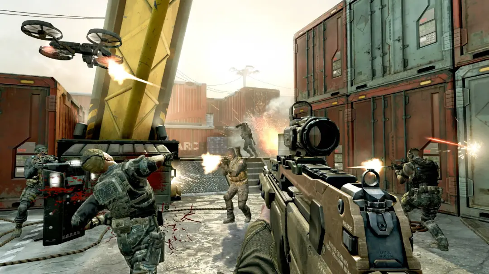

# 4. Fallstudien

**Lernziele**  

- Welche bestehenden Videospiele können wir nutzen?
- Was können wir durch kommerzielle Videospiele lernen?

## Lernspiele

### Antura & die Buchstaben

Das pädagogische Ziel des Spiels besteht darin, den Spielern zu helfen, die Grundlagen der arabischen Schriftsprache zu erlernen, einschließlich der arabischen Buchstaben, des Leseverständnisses und einiger Vokabeln. Das Spiel verfolgt aber auch ein soziales Ziel, um den Spielfluss, das Engagement und die Motivation zu fördern

**Lehrplanmäßige Verbindungen**: Spracherwerb; arabische Alphabetisierung; soziales und emotionales Lernen 
> **Mögliche vermittelte Fähigkeiten**: Erkennen von Buchstaben (Formen, Namen, Phoneme); Silben und Wortlesen; Wortschatz

Website: [antura.org](https://www.antura.org)

### Drachenbox

Durch das Spielen mit den digitalen Manipulatoren in den *DragonBox-Spielen* verstehen die SchülerInnen die mathematischen Konzepte durch aktives Engagement und lernen dabei in ihrem eigenen Tempo.  Jedes unserer Spiele basiert auf "digitalen Manipulatoren".  Diese digitalen Manipulatoren wurden entwickelt, um als Lehrmittel zusammen mit dem Unterricht und Diskussionen im Klassenzimmer verwendet zu werden.  
Website: [dragonbox.com](https://dragonbox.com/)

### Dumb Ways to Die

Eine australische öffentliche Kampagne von Metro Trains in Melbourne, Victoria, Australien, zur Förderung der Eisenbahnsicherheit.   
Website: [dumbwaystodie.com](http://www.dumbwaystodie.com)

### iCivics

**iCivics** hat es sich zur Aufgabe gemacht, Schülerinnen und Schüler für ein sinnvolles staatsbürgerliches Lernen zu begeistern. Wir stellen Lehrern gut geschriebene, originelle und kostenlose Ressourcen zur Verfügung, die ihre Praxis verbessern und ihre Klassenzimmer inspirieren. über. **iCivics** stellt die staatsbürgerliche Bildung für die amerikanische Demokratie neu vor.  
Website: [icivics.org](https://www.icivics.org)

### Andere Titel
- [Ludwig](http://www.playludwig.com) - Lernspiel für Physik
- [80 Days](https://www.inklestudios.com/80days/) - adaptives Lernspiel für Geographie
- [Roma Nova](https://www.irit.fr/~David.Panzoli/romanova.html) - Geschichtsunterricht mit Gehirnschnittstellen
- [Bionigma](https://www.gcc.tu-darmstadt.de) - Wissenschaftsspiel zur Erforschung von Proteinen
- [Meister Cody](https://www.meistercody.com) - Lernspiel für Dyskalkulie
- [Orwell: Keeping an Eye on You](https://www.osmoticstudios.com/orwell-keeping-an-eye-on-you/) - Erlernen der Verwaltung persönlicher Daten

## Gesundheit

### Das Spiel, das Ihnen 10 zusätzliche Lebensjahre schenken kann

Die Spieldesignerin Jane McGonigal ist der festen Überzeugung, dass es bei Videospielen nicht nur darum geht, Knöpfe zu drücken und das nächste Level zu erreichen. Während ihres Vortrags bei TEDGlobal 2012 nannte McGonigal einige überraschende Statistiken: dass Online-Spiele bei der Behandlung von **klinischen Depressionen** wirksamer sein können als Medikamente und dass nur 30 Minuten am Tag mit einer signifikanten **Glückssteigerung** verbunden sind.

📽 #VIDEO [Das Spiel, das Ihnen 10 zusätzliche Lebensjahre geben kann](https://www.ted.com/talks/jane_mcgonigal_the_game_that_can_give_you_10_extra_years_of_life)
<iframe width="937" height="527" src="https://www.youtube.com/embed/lfBpsV1Hwqs" title="Das Spiel, das Ihnen 10 zusätzliche Lebensjahre geben kann | Jane McGonigal" frameborder="0" allow="accelerometer; autoplay; clipboard-write; encrypted-media; gyroscope; picture-in-picture" allowfullscreen></iframe>

### Einige Titel
- [Re-Mission](https://hopelab.org/case-study/re-mission/) - helfen Sie jungen Krebspatienten bei der Einhaltung ihrer Behandlung
- [Zombie Run](https://zombiesrungame.com) - Laufen Sie in der realen Welt. Werde ein Held in einer anderen.
- Play Forward](https://www.play2prevent.org/our-games/playforward-elm-city-stories/) - HIV-Prävention
- Respir Games (Asthma-Therapie)
- BalanceFit (Gleichgewichts-, Koordinations- und Krafttraining)
- [NEUROvitalis](https://www.headapp.com/en/neurovitalis-en/) - personalisiertes kognitives Training
- KickAss (Autismus-Spiel für Heranwachsende)
- [Zirkus Empathica](https://www.zirkus-empathico.de/) - Autismusspiel für Kinder
- [SPARX](https://www.sparx.org.nz/home) - Spiel zur psychischen Gesundheit für Jugendliche und Heranwachsende

## Empathie

> Die Fähigkeit, sich mit der Situation oder den Gefühlen eines anderen zu identifizieren oder sie zu verstehen.

### This War of Mine

This War of Mine ist ein Kriegssimulationsspiel, das sich von den meisten Videospielen mit Kriegsthematik dadurch unterscheidet, dass es sich auf die Erfahrungen der Zivilbevölkerung im Krieg konzentriert und nicht auf den Kampf an der Front. Die Charaktere müssen viele schwierige Entscheidungen treffen, um die täglichen Gefahren zu überleben. Je nach den im Spiel getroffenen Entscheidungen gibt es für jeden Charakter verschiedene Enden.  
Website: [thiswarofmine.com](http://www.thiswarofmine.com)

### Papers, Please

**Papers, Please** ist ein "dystopischer Dokumententhriller" für Einzelspieler, in dem der Spieler in die Rolle eines Einwanderungsinspektors im fiktiven Land Arstotzka im Jahr 1982 schlüpft. Da der Spieler an der Schwelle zwischen zwei verschiedenen Ländern steht, ergibt sich aus der banalen Aufgabe, Papiere zu prüfen, eine einzigartige Perspektive der Einwanderung und Grenzsicherung. Auf einer zweiten Ebene muss der Spieler gleichzeitig seine Familie mit dem Gehalt aus dem Job versorgen, das davon abhängt, wie viele Personen an einem Tag abgefertigt wurden. Der Spagat zwischen der Sicherheit der Grenze und den Bedürfnissen der Familie ist einzigartig menschlich und schafft ein neues und interessantes Nebeneinander.  
Website: [papersplea.se](https://www.papersplea.se/)

### Bounden

**Bounden** ist ein Smartphone-Tanzspiel, das die Spieler dazu bringt, ihren Körper einzusetzen. Zwei Personen halten die beiden Enden eines Smartphones in der Hand und bewegen sich gemeinsam, um den Cursor über dem Ball zu halten. Was als neuartige Art der Interaktion mit dem Spiel beginnt, ermutigt die beiden Spieler nach und nach dazu, sich gemeinsam kreativ zu bewegen, während sie jeden Level abschließen.  
Website: [playbounden.com](http://playbounden.com)

## Ethik
> Ethik ist die Kunst und Wissenschaft der Analyse von Fragen nach gut, schlecht, richtig, falsch, gerecht und ungerecht.

### Friedensstifter

Ein Regierungssimulationsspiel, das den israelisch-palästinensischen Konflikt simuliert.   
Website [peacemakergame.com](http://peacemakergame.com)

### Telefongeschichte

Phone Story ist ein Spiel für Smartphone-Geräte, das versucht, eine kritische Reflexion über die eigene technologische Plattform zu provozieren. Unter der glänzenden Oberfläche unserer elektronischen Geräte verbirgt sich das Produkt einer beunruhigenden Lieferkette, die sich über den ganzen Globus erstreckt. Phone Story stellt diesen Prozess mit vier Lernspielen dar, die den Spieler symbolisch an der Coltan-Gewinnung im Kongo, der ausgelagerten Arbeit in China, dem Elektroschrott in Pakistan und dem Gadget-Konsum im Westen teilhaben lassen.
http://phonestory.org

### Unbemannt

Die meisten Shoot-em-up-Videospiele lassen den Krieg actionreich und glamourös erscheinen. Unmanned versucht, ein weitaus realistischeres Bild zu zeichnen, indem es den Spieler in die Rolle eines Soldaten versetzt, der neben seinen militärischen Pflichten auch mit Langeweile und traumatischen Träumen zu kämpfen hat.
http://unmanned.molleindustria.org

### Data Dealer
Data Dealer ist ein Online-Spiel über das Sammeln und Verkaufen persönlicher Daten - voller Ironie und fröhlichem Sarkasmus. Es ist ein Browser-/Serien-/Eduro-/Impact-Spiel über digitale Kultur und Überwachung und soll auf neue und unterhaltsame Weise das Bewusstsein für den Online-Datenschutz schärfen.

https://datadealer.com

### Half the Sky Movement

The Game ist ein auf einem Spiel basierendes Abenteuer, das ein breites Publikum erreichen soll, um das Bewusstsein zu schärfen und Spenden zu sammeln, um Frauen und Mädchen auf der ganzen Welt zu unterstützen.

http://www.halftheskymovement.org

### Schicksal der Welt

Fate of the World ist ein dramatisches globales Strategiespiel, das unsere Zukunft in Ihre Hände legt. Das Spiel bietet eine Reihe dramatischer Szenarien, die auf den neuesten wissenschaftlichen Erkenntnissen basieren und die nächsten zwei Jahrhunderte abdecken. Sie müssen einen Balanceakt zwischen dem Schutz der Ressourcen und des Klimas der Erde und den Bedürfnissen einer ständig wachsenden Weltbevölkerung bewältigen.

https://www.soothsayergames.com

## Andere Spiele für den sozialen Nutzen

**Welt ohne Öl**  
In diesem Spiel, das ebenfalls von McGonigal entwickelt wurde, werden die Spieler in eine Welt versetzt, in der die Ölvorkommen angezapft wurden und in der sie kreativ werden müssen, um die massive globale Verknappung zu überleben. Das Beste an diesem Spiel? Es lehrt einfache Möglichkeiten, in der realen Welt weniger Öl zu verbrauchen - Gewohnheiten, die die Spieler nach eigenen Angaben auch dann beibehalten, wenn sie nicht spielen.  
[Website](http://www.worldwithoutoil.org)

**FoldIt**  
FoldIt ist ein Online-Spiel zum Falten von Proteinen, das es einer Viertelmillion Spielern ermöglicht, durch das Stabilisieren von Aminosäurenketten zur wissenschaftlichen Forschung beizutragen. Stellen Sie es sich wie biologisches Tetris vor - FoldIt macht aus der biologischen Mustererkennung einen Wettbewerb, der zu innovativen Lösungen für Probleme führt, die die Wissenschaft seit Jahren frustrieren.  
[Website](http://fold.it/portal)

**WAY**   
Es ist nicht einfach, über Sprachen und Kulturen hinweg zu kommunizieren. Aber in diesem Online-Spiel müssen zwei anonyme Spieler, die aus verschiedenen Orten rund um den Globus stammen, lernen, miteinander zu sprechen, während sie Hindernisse überwinden. Das von CoCo & Co entwickelte Spiel wurde bei den diesjährigen Games for Change Awards mit der höchsten Auszeichnung bedacht.  
[Website](http://www.makeourway.com/)

**Budget Hero**    
Denkst du, du könntest den Staatshaushalt ausgleichen? Dann ist dieses Spiel von American Public Media genau das Richtige für Sie. Bei diesem Spiel können die Spieler sehen, was mit dem nationalen Defizit passiert, wenn sie die Mittel für Programme erhöhen oder sich für schwierige Kürzungen entscheiden. "Jedes Mitglied des Kongresses sollte verpflichtet sein, dieses Spiel zu spielen", sagte einer der Erfinder des Spiels.  
[Website](http://www.marketplace.org/topics/economy/budget-hero)

**Pain Squad**  
Krebskranke Kinder und Jugendliche werden oft gebeten, ein Schmerztagebuch zu führen - ein Papierkram, der nicht nur langweilig ist, sondern auch ihre Aufmerksamkeit auf ihre Beschwerden lenkt. Die iOS-App Pain Squad macht den ganzen Prozess unterhaltsam und interaktiv - und hilft den Ärzten gleichzeitig, die jungen Patienten besser zu behandeln.  
[Website](http://www.campaignpage.ca/sickkidsapp/)

**Ausgegeben**  
Wenn das Bankkonto schwarze Zahlen schreibt, denkt man leicht, dass sich jeder am eigenen Schopf aus der Armut ziehen kann. Aber in diesem Online-Spiel müssen die Spieler nach Arbeit suchen und dabei mit 1000 Dollar im Monat überleben. Das zeigt, dass Armut und Arbeitslosigkeit systematisch sind und nicht nur das Ergebnis von Charakterfehlern.  
[playspent.org](http://playspent.org/)

**Evoke**  
Dieses Spiel, das vom Weltbankinstitut in Zusammenarbeit mit McGonigal entwickelt wurde, ist ein 10-wöchiger Crashkurs in sozialer Innovation, bei dem den Spielern Aufgaben von "Lebensmittelsicherheit" bis hin zu "städtischer Resilienz" gestellt werden und sie dazu ermutigt werden, eine Denkfabrik für lokale Herausforderungen zu werden.  
[www.urgentevoke.com](http://www.urgentevoke.com)

## Ausbildung und Simulation

📽 #VIDEO [Mit Spielen bessere Städte bauen](https://www.ted.com/talks/karoliina_korppoo_how_a_video_game_might_help_us_build_better_cities/)
<iframe width="937" height="527" src="https://www.youtube.com/embed/qYUmI5kGsYk" title="Wie ein Videospiel uns helfen könnte, bessere Städte zu bauen | Karoliina Korppoo" frameborder="0" allow="accelerometer; autoplay; clipboard-write; encrypted-media; gyroscope; picture-in-picture" allowfullscreen></iframe>

Einige Titel:
- [Democracy](https://positech.co.uk/democracy/) - politisches Strategiespiel
- [Flugsimulator](https://www.flightsimulator.com)
- [Lost Earth 2307](https://www.iosb.fraunhofer.de/en/projects-and-products/lost-earth-2307.html) - Bildinterpretation, Militär
- [Ship Simulator](https://www.shipsim.com) - Maritime Suche und Rettung
- [SchaVIS](https://www.youtube.com/watch?v=xMvV7oOJozw) - Hochwassersimulation und -prävention
- Sharkworld](https://www.xmediaworks.nl/en/portfolio-items/sharkworld-a-project-management-game/) - Projektmanagement-Schulung
- [Houthoff Buruma](https://annex.fandom.com/wiki/Houthoff_Buruma_The_Game) - Rekrutierung und Bewertung

## Kommerzielle Spiele
Für die ausgewählten Spiele versuchen wir, die **curricularen Verbindungen** (Lernthemen) und die **möglicherweise vermittelten Fähigkeiten** zu extrahieren.

## Abenteuer

### Gone home

Ein First-Person-Erkundungsspiel, in dem der Spieler die Rolle von Kaitlin Greenbriar spielt, einer Studentin, die von einer Auslandsreise zurückkehrt. Am beunruhigendsten ist der Verbleib von Kaitlins jüngerer Schwester Sam, die verschwunden ist, wenn auch nicht spurlos. Um herauszufinden, was mit Sam passiert ist, muss der Spieler Hinweisen und Tagebucheinträgen folgen, um zahlreiche Geheimnisse im Haus zu lüften.

**Lehrplananbindung:** Englische Sprachkunst; Erzählforschung; soziales und emotionales Lernen; Medienkompetenz  
** Mögliche vermittelte Fähigkeiten:** Umweltbezogenes Erzählen; Charakterentwicklung; Genre; lineare vs. nicht-lineare Erzählung; Spielmechanik und Erzählung; Intertextualität; Perspektivenübernahme

### The walking dead

The Walking Dead erzählt die Geschichte von Lee Everett, einem Lehrer aus Atlanta, der mitten in eine Zombie-Apokalypse gerät. Der Spieler schlüpft in die Rolle von Lee und erlebt die Prüfungen und Herausforderungen, die er und andere Überlebende zu meistern haben. Das Gameplay ist ziemlich einfach und besteht hauptsächlich darin, Lee zu steuern, um seine Umgebung zu erkunden und seine Dialogzeilen im Gespräch mit anderen Charakteren auszuwählen. Dabei muss der Spieler in schwierigen, komplexen moralischen Dilemmas an Lees Stelle handeln.

> **Lehrplananbindung:** Moralphilosophie; Ethik; soziale Normen, Ideengeschichte  
> Mögliche vermittelte Fähigkeiten:** Entscheidungsfindung; Systemdenken; höhere Denkfähigkeiten wie Ursache und Wirkung; kritisches Denken; Reflexion; Verbindungen von Spiel zu sich selbst; Verbindungen von Spiel zu Welt; Achtsamkeit

Tipps:
1. Die Lehrkräfte sollten die Episode, die sie verwenden werden, mindestens zweimal spielen, da ein tiefes Wissen über das Spiel entscheidend ist, um die notwendigen Verbindungen zum Lehrplan herzustellen.
2. Die Lehrer sollten die Schüler ermutigen, ihre Argumente auf ethische Theorien zu stützen und nicht nur auf ihr "Bauchgefühl".

### Life is Strange

Der Spieler schlüpft in die Rolle der weiblichen Figur Max Caulfield, einer achtzehnjährigen Fotostudentin, die versucht, die Bewohner der Stadt vor einem katastrophalen Tornado zu retten, der über die Bucht hereinbrechen könnte. Der Spieler spielt das Spiel in der Third-Person-Perspektive und steuert die Bewegungen der Figur Max, um die Spielumgebung zu erkunden, die Spielgeschichte durch Max' Beteiligung an verschiedenen Ereignissen aufzudecken und lebensverändernde Entscheidungen für Max zu treffen, die auf den Wahlmöglichkeiten basieren, die die verzweigte Erzählung des Spiels bietet.

Der Spieler wird mit mehreren herausfordernden moralischen Dilemmas konfrontiert, die von ihm verlangen, Entscheidungen zu treffen, die letztendlich einem Charakter zugute kommen, für einen anderen aber verheerende Folgen haben können.

Darüber hinaus kann der Spieler die Folgen rückgängig machen, indem er die Spielmechanik der zurücklaufenden Uhr aktiviert, um zu früheren Zeitpunkten zu reisen, und indem er verschiedene Entscheidungen trifft, die zukünftige Ereignisse beeinflussen können.

**Lehrplanverbindungen:** Philosophie; Ethik; Logik; englische Sprachkunst; soziale und emotionale Fähigkeiten  
> Mögliche vermittelte Fähigkeiten:** Philosophische Analyse; ethische Analyse; narratives Design; logisches Denken; Analyse moralischer Dilemmata; narratives Design

### Assassin's Creed (Serie)

Die Serie umfasst zehn erzählerisch orientierte Standardspielkapitel, die jeweils unterschiedliche Zeitepochen und Schauplätze abdecken, mit einem Erzählbogen, der vom ptolemäischen Ägypten über das Heilige Land zur Zeit des dritten Kreuzzugs, das Italien der Renaissance, das Amerika der Kolonialzeit und die Französische Revolution reicht. Der Schwerpunkt des Spiels liegt auf der Erkundung der offenen Welt, dem Sammeln von Hinweisen und Beweisen sowie der Beschaffung oder Übermittlung von Informationen.

**Lehrplanverbindungen**: Weltgeschichte; Weltkulturen; Kunst; Englisch lernen; Sprachen lernen; Kunst- und Architekturgeschichte; Kolonialgeschichte; Piratengeschichte; Musik  
> Mögliche vermittelte Fähigkeiten**: Wertschätzung von Kunst und Architektur; Wertschätzung von Musik; aufgabenbezogene Problemlösung; Hör- und Leseverständnis (ESL, Fremdsprachen); ethische Entscheidungsfindung; Argumentation; Empathie; Analyse moralischer Dilemmata

### The Legend of Zelda: Breath of the Wild

Das Spiel versetzt den Spieler in eine riesige, offene Welt, in der Link alle Freiheiten hat, die vielen Schauplätze des Spiels zu erkunden und eine Vielzahl von Abenteuern, Monstern und Rätseln zu meistern. Da das Spiel zum Experimentieren und Erforschen anregt, kann jeder Spieler die Geschichte nach seinem eigenen Tempo und seinen Fähigkeiten gestalten.

> **Lehrplanmäßige Verbindungen:** Soziale und emotionale Fähigkeiten; Management  
> **Mögliche vermittelte Fähigkeiten**: Konzentration, Organisation, Zeitmanagement; Arbeitsgedächtnis; exekutive Funktionen

**Tipps:** 
1. Nachdem die SchülerInnen Breath of the Wild gespielt haben, sollten die LehrerInnen sicherstellen, dass sie verstehen, wie die exekutiven Fähigkeiten im Spiel eingesetzt wurden.
2. Eine Möglichkeit, wie Lehrer die Reflexion über die im Spiel verwendeten Fähigkeiten unterstützen können, besteht darin, die Schüler dazu zu ermutigen, konkrete Beispiele aufzuschreiben, bei denen der erfolgreiche Abschluss von Quests den Einsatz der einzelnen Fähigkeiten erforderte.

## Plattform

### Braid

BRAID ist ein seitlich scrollendes Abenteuer. Jede der sechs Welten des Spiels verfügt über eine andere **Zeitverschiebungs-Spielmechanik**, die dazu dient, eine Reihe von **kniffligen Rätseln** zu entschlüsseln. Je nach Level und Umständen kann sich die Zeit verlangsamen, Feinde können sich vorwärts oder rückwärts bewegen, je nachdem, in welche Richtung unser kleiner Held im blauen Anzug läuft, oder die Uhr bleibt ganz stehen. **Die Spieler können die Zeit** jederzeit und in jedem Level beliebig weit zurückspulen.

### Niemals allein

In Never Alone spielst du ein junges Inupiat-Mädchen, Nuna, das sich auf eine Reise begibt, um die Quelle eines ewigen Schneesturms zu finden, der ihr Dorf zu zerstören droht. Auf ihrem Weg trifft sie auf einen Polarfuchs und eine Reihe von Geisterwesen, die ihr auf ihrer Reise helfen. Never Alone ist ein Puzzle-Plattformer, bei dem der Spieler entweder Nuna oder ihren arktischen Fuchsgefährten steuern kann, um eine Reihe von Rätseln zu lösen, die ein Verständnis dafür erfordern, wie verschiedene Inupiat-Werkzeuge, Umweltelemente (z. B. wilde Tiere und Wetter) und NSCs (meist in Form von Inupiat-Geisterwesen) funktionieren. 

> **Lehrplanmäßige Verbindungen:** Sozialkunde; soziales und emotionales Lernen  
> **Mögliche vermittelte Fähigkeiten:** Systemdenken; Zusammenarbeit; Entscheidungsfindung

### Super Mario Maker 2

## Puzzle

### Reden Sie weiter und niemand explodiert

Keep Talking and Nobody Explodes ist ein kooperatives Virtual-Reality (VR)-Puzzlespiel, bei dem die Spieler eine Bombe innerhalb einer bestimmten Anzahl von Minuten entschärfen müssen. Bei diesem Spiel schlüpfen die Spieler in eine von zwei Rollen: den VR-Spieler und den/die manuellen Experten. Der VR-Spieler trägt ein Virtual-Reality-Headset, während die Handbuch-Experten auf eine separate Ressource namens Bombenhandbuch zugreifen. Sobald das Spiel beginnt, wird der VR-Spieler in einen fensterlosen Raum im Stil einer polizeilichen Untersuchung versetzt, in dem sich die Bombe und einige Werkzeuge befinden. Jede Bombe besteht aus einem Zeitzünder und einer Vielzahl von Modulen, die komplexe Symbole oder Regelwerke enthalten. Der VR-Spieler kann die Bombe und andere Objekte im Raum sehen, manipulieren, drehen und bewegen. Im Gegensatz dazu kann der Handbombenexperte die Bombe nicht sehen, aber er kann das Bombenhandbuch durchlesen.

**Lehrplanmäßige Verbindungen**: Informatik; Kommunikation; Englische Sprachkunst; Lesen 
**Möglicherweise vermittelte Fähigkeiten**: Logik; Problemlösung; verbale Kommunikation; Leseverständnis; Teamarbeit

### Threes!

**Lehrplanmäßige Verbindungen**: Mathematik 
**Möglicherweise vermittelte Fähigkeiten**: Logik; Problemlösung

### Rätsel

**Fachliche Verbindungen**: Kommunikation; Lesen 
**Möglicherweise vermittelte Fähigkeiten**: Logik; Problemlösung; verbale Kommunikation; Leseverständnis; Teamarbeit

### Monument Valley

Monument Valley ist ein von MC Escher inspiriertes Puzzlespiel, das die Architektur verbiegt und eine stumme Prinzessin durch eine fesselnde Welt begleitet. 
Was das Spiel einzigartig macht, sind die Landschaften des Spiels. Die Spieler können Teile bestimmter Gebäude ziehen und drehen, um einen Weg von einem Bereich zum nächsten zu schaffen. In anderen Bereichen kann man durch das Betreten von Auslösefeldern die Schwerkraft verändern und an einer Wand entlanglaufen. Die Spielphysik basiert auf der Wahrnehmung, d. h., wenn man in der Lage ist, Elemente so zu positionieren, dass ein Weg zu existieren scheint, kann man ihn auch benutzen, selbst wenn dieser Weg in der realen Welt nicht existieren würde.

### Der Raum

> **Fachliche Verbindungen:** Mathematik; Sozialkunde; Kunst; Medienkunde; Informatik; Psychologie; Soziologie; Anthropologie; Biologie; Chemie  
> **Mögliche vermittelte Fähigkeiten:** Informationskompetenz; quantitatives Denken; kritisches Denken; technologische Kompetenz; Programmierung

### Portal 2

Portal 2 (Valve Corporation, 2011) ist eine Fortsetzung des ursprünglichen Portals, beides sehr beliebte Ego-Puzzle-Spiele, in denen sich der Spieler durch die Umgebung bewegt, indem er Start- und Endportale in ansonsten unverbundene Oberflächen schießt und so eine Verbindung schafft, durch die der Spieler Objekte, einschließlich sich selbst, bewegen kann. Das Spiel erfordert ein **ausgedehntes räumliches Vorstellungsvermögen** und wurde schnell für seinen potenziellen Nutzen für das **Lernen von Physik, Problemlösung und kritischem Denken** erkannt.

**Verbindungen zum Lehrplan:** Physik, Geometrie, englische Sprachkunst; soziales und emotionales Lernen
> **Vermögliche vermittelte Fähigkeiten:** Kommunikationsfähigkeiten; Teamarbeit; Problemlösung; kritisches Denken; logisches Denken; räumliche Analyse; Beschäftigungs-/Karrierefähigkeiten

{: .highlight }
> Wie man Portal 2 in einem MINT-/Physikunterricht einsetzt: [hier lesen](https://www.foundry10.org/programs/games-and-learning/portal-2)

## Rollenspiel

### Final Fantasy-Reihe

**Fachliche Verbindungen:** Moderne Literatur; Science Fiction; Kulturwissenschaften; Medienwissenschaften, Geisteswissenschaften; Psychologie; Urbanistik  
**Möglicherweise vermittelte Fähigkeiten:** Kritisches Denken, Kreativität, ethisches Urteilsvermögen

### World of Warcraft

World of Warcraft (WoW) ist heute eines der ersten und größten abonnementbasierten Massively Multiplayer Online Role-Playing Games (MMORPGs). WoW bietet den Spielern zwei Fraktionen (Allianz und Horde), die miteinander konkurrieren und zusammenarbeiten, um ihre Welt, Azeroth, vor äußeren und inneren Bedrohungen zu schützen. Die Spieler können an einer Mischung aus Aktivitäten wie **individuellen** und **gemeinsamen** Quests, Sammel- und Handwerksberufen, Schlachtzügen, Schlachtfeldern, Arenen, sozialem und privatem Textchat und einem kombinierten Auktionshaus mit offenen Angeboten teilnehmen. Die Spieler können auch zwischen individuellem Spiel, dem Beitritt zu Gruppen von bis zu 40 Spielern oder dem Beitritt zu Gilden mit 100 Mitgliedern wählen.

**Schulische Verbindungen:** Buchhaltung; Wirtschaft; Lieferkettenmanagement  
> **Möglicherweise vermittelte Fähigkeiten:** Marktforschung; Bilanzen; Marketing; Tabellenkalkulationen; Handel

### Deus EX - Human Revolution

Eine fesselnde Cyberpunk-Umgebung mit beeindruckender Grafik, spannender Handlung und fesselnden Charakteren. Die Handlung wechselt, wie in Cyberpunk-Romanen, zwischen Megastädten oder urbanen Zentren. Die Erzählung und das Gameplay des Spiels drehen sich um den Transhumanismus.

**Fachliche Verbindungen:** Moderne Literatur; Science Fiction; Kulturwissenschaften; Medienwissenschaften, Geisteswissenschaften; Psychologie; Urbanistik  
**Möglicherweise vermittelte Fähigkeiten:** Kritisches Denken, Kreativität, ethisches Urteilsvermögen

## Shooter

### DOOM

### Call of Duty

In der **Einzelspielerkampagne** schlüpft der Spieler in die Rollen verschiedener Charaktere, darunter ein US-Marine und ein britischer Special Air Service (SAS)-Agent. Die Perspektive des Spielers ändert sich je nach Charakter und je nachdem, wie sich die Handlung durch nicht spielbare Ereignisse und spielbare Missionen weiterentwickelt. Die Missionen beinhalten in der Regel Ziele, die auf der Beseitigung von Feinden, dem Passieren von Kontrollpunkten, der Sicherung von Zielen gegen Angreifer oder der Zerstörung eines feindlichen Standorts basieren. In der **Multiplayer**-Version nutzt die Serie diese Mechanismen für verschiedene teambasierte und Deathmatch-basierte Modi auf unterschiedlichen Karten.

**Lehrplanverbindungen:** Geschichte; Politik; internationale Beziehungen; Ethik   
> Mögliche vermittelte Fähigkeiten:** Ethische Entscheidungsfindung; ethisches Design; Analyse moralischer Dilemmata, narratives Design

### Fortnite

Fortnite ist ein von Epic Games im Jahr 2017 veröffentlichtes Online-Actionspiel. Es ist in einer nahen Zukunft angesiedelt und nimmt eine Third-Person-Perspektive und eine cartoonartige Ästhetik an. Es umfasst drei verschiedene Modalitäten.

- Fortnite: **Battle Royale** ahmt die Formel von PlayerUnknown's Battlegrounds nach, indem es ein spielerisches System präsentiert, bei dem bis zu 100 Spieler in den Modi Einer-gegen-Einen oder Team-gegen-Team gegeneinander antreten.
- Fortnite: **Save the World** ist ein kooperatives Überlebenserlebnis, bei dem vier Spieler verschiedene Missionen gegen das Spiel erfüllen müssen. Die Aufgaben umfassen das Töten von Feinden, das Sammeln von Materialien und das Bauen von Unterkünften, um die Zombie-Armeen aufzuhalten.
- Fortnite **Creative** ist ein kreativer Modus, der verschiedene Bearbeitungswerkzeuge bietet. Die Spieler können auf personalisierten Inseln verschiedene Strukturen und Objekte bauen und herstellen.

> **Lehrplananbindung:** Kritische Theorie; digitale Kulturen; Bildungstechnologie; soziales und emotionales Lernen  
> **Mögliche vermittelte Fähigkeiten:** Kollaboratives Denken; konnektivistisches Denken; Kreativität; kritisches Denken; soziale Medienkompetenz

## Sport

### NBA2K14

**Lehrplanverbindungen:** Sozialkunde; Biomechanik; Wirtschaft; Biometrie; Management **Mögliche vermittelte Fähigkeiten:** Systemdenken; Zusammenarbeit; Entscheidungsfindung; kritisches Spielvokabular; kritisches Denken; historisches Bewusstsein

## Strategie

### Zivilisation 

Die Spieler führen eine Zivilisation von der Bronzezeit bis in die nahe Zukunft und treten dabei gegen andere Menschen oder einen künstlich intelligenten Computerspieler an, wobei sie Punkte dafür erhalten, wie mächtig und fortschrittlich ihre Zivilisation wird. Vor Beginn des Spiels wählen die Spieler eine von mehreren Zivilisationen aus, die sie anführen möchten. Jede dieser Zivilisationen verfügt über einzigartige Gameplay-Fähigkeiten, die auf den Umständen oder Errungenschaften ihrer realen Gegenstücke basieren.

**Verbindungen zum Lehrplan:** Geschichte; Geografie; Staatsbürgerkunde; Wirtschaft; Soziologie  
**Mögliche vermittelte Fähigkeiten:** Kritisches Denken; Experimentieren; Kosten-Nutzen-Analyse; Zusammenarbeit; forschungsbasiertes Lernen

**Tipps:**
1. Die Lehrkräfte sollten sich Zeit nehmen, um die Struktur, die Steuerung und die Mechanik des Spiels kennenzulernen, bevor sie es den Schülern vorstellen.
2. Die SchülerInnen könnten anfangs etwas frustriert sein, wenn sie lernen, wie man spielt.
3. Die Lehrer können bestimmte Themen erforschen, indem sie ihr eigenes Spiel oder Szenario erstellen.
Hunderte von kostenlosen, von Spielern erstellten Mods können online gefunden werden.

### Pandemie

Pandemic ist ein kooperatives Spiel, in dem ein Team von Spielern einzigartige Rollen (z. B. Sanitäter, Wissenschaftler, Forscher) als Mitglieder einer globalen Gesundheitsorganisation übernimmt, die mit der Bekämpfung von Krankheitsausbrüchen und schließlich der Heilung von vier Seuchen beauftragt sind, die überall auf dem Planeten auftauchen. Die Spieler stehen vor der kollektiven Entscheidung, wie sie ihre individuellen Ressourcen am besten einsetzen, um unmittelbare Gesundheitszustände zu bekämpfen oder einen langfristigen Plan zur Heilung jeder Krankheit zu entwickeln.

**Lehrplanverbindungen:** Öffentliche Ordnung; Epidemiologie; Gesundheit; Biologie; soziales und emotionales Lernen; Informationswissenschaften  

**Möglicherweise vermittelte Fähigkeiten:** Algorithmenbildung; wahrscheinlichkeitsbasierte Vorhersage; Argumentation; Rhetorik; Zusammenarbeit; Kommunikation; Fürsprache; Planung; Entscheidungsfindung; Logik

### SimCity

SimCity ist ein Simulationsvideospiel, dessen Hauptziel es ist, aus einer kleinen Stadt eine blühende Stadt zu entwickeln. Der Spieler steuert die Entwicklung der Stadt, indem er Entwicklungszonen festlegt, technische Infrastruktur (z. B. Straßen und Wasserversorgungsanlagen) einrichtet und Dienstleistungen (z. B. Schulen und Feuerwehren) bereitstellt. Die Art der Entwicklungszonen (Industrie-, Gewerbe- oder Wohngebiete) bestimmt die Art der Gebäude, die automatisch in der Zone errichtet werden. Während des Spiels müssen die Spieler ständig für ausgewogene Entwicklungsbedingungen sorgen, wie z. B. die Einhaltung des Budgets und die Zufriedenheit der Bürger.

**Lehrplanverbindungen**: Stadt- und Regionalplanung, Stadtentwicklung, Stadtgeographie, (staatliche) Politikgestaltung, technische Infrastruktur, Umweltstudien

**Vermittelte Fähigkeiten:** Systemdenken, Systemplanung und -steuerung, Systementwicklung, Konzept der Nachhaltigkeit

### This War of Mine

Im Gegensatz zu einem typischen Kriegsspiel, bei dem die Spieler normalerweise die Rolle von fähigen Soldaten übernehmen, versetzt dieses Spiel den Spieler in die Rolle einer Gruppe von Zivilisten, die in einer belagerten Stadt leben und versuchen zu überleben.

**Lehrplanmäßige Verbindungen:** Soziales und emotionales Lernen; Ethik; Spieldesign
**Mögliche vermittelte Fähigkeiten:** Empathie; moralische Dilemmas; Entscheidungsfindung; narratives Design
**Tipps:**
1.  Das Spiel kann auch außerhalb des Klassenzimmers gespielt werden, um eine umfassendere Erfahrung zu ermöglichen.
2.  Für eine fortgeschrittene Studie können die Schüler das Spiel mit einem schwächeren Charakterprofil beginnen - anstelle der in Abbildung 3 vorgeschlagenen Anfangseinstellungen - um die Moral und die Entscheidungsfähigkeit des Spielers herauszufordern.

## Gelegenheitsspiele

### Fancade

Fancade ist eine riesige Sammlung von einfachen Spielen. Spielen Sie sie sofort, oder erstellen Sie Ihr eigenes Spiel mit Drag-n-Drop-Bausteinen!
Website: [fancade.com](https://www.fancade.com)

## Sandbox

### Minecraft

Minecraft ist ein Open-World-Spiel, das den Spielern unbegrenzte Möglichkeiten zur Erkundung und Gestaltung bietet. Das Spiel findet in einer pixeligen 3-D-Umgebung statt, die einer natürlichen Welt mit vielen verschiedenen Biomen (z. B. Wälder, Tundra und Wüsten) ähnelt. Jedes Element der Welt wird aus Blöcken der entsprechenden Materialien hergestellt. Zum Beispiel werden Bäume aus Holzblöcken und Erze aus Erzblöcken hergestellt. Die Spieler können diese Blöcke mit ihren Händen oder mit Werkzeugen, die im Spiel aus gefundenen Materialien hergestellt werden, aufbrechen und sammeln. Das Überleben ist das Hauptziel von Minecraft, das auf der Fähigkeit der Spieler beruht, ihre eigene Gesundheit und ihr Wohlbefinden zu erhalten.

**Lehrplanmäßige Verbindungen:** Grundlegendes Wissen (Englisch, Geografie); Metawissen (Ursache und Wirkung, erzählerische Erfahrung); humanistisches Wissen (kulturelle Kompetenz)   
**Mögliche vermittelte Fähigkeiten:** Schreiben; kritisches Denken; Erforschung; Experimentieren; Ursache und Wirkung; Kartierung; Bauen; Design; Kreativität; Ressourcenmanagement; Kommunikation

Website: [minecraft.net](https://www.minecraft.net)

### Kerbal Space Program

Übernehmen Sie die Leitung des Raumfahrtprogramms für die außerirdische Rasse der Kerbals. Sie haben Zugang zu einer Reihe von Teilen, um voll funktionsfähige Raumschiffe zusammenzubauen, die auf der Grundlage realistischer aerodynamischer und orbitaler Physik fliegen (oder auch nicht). Bringen Sie Ihre Kerbal-Crew in den Orbit und darüber hinaus (und halten Sie sie am Leben), um Monde und Planeten im Kerbol-Sonnensystem zu erforschen, und bauen Sie Basen und Raumstationen, um die Reichweite Ihrer Expedition zu vergrößern.  
Website: [kerbalspaceprogram.com](https://www.kerbalspaceprogram.com)

---
## Unit Review
- Beschreiben Sie ein Videospiel, das Sie kennen, und die Verbindungen zum Lehrplan sowie die möglicherweise vermittelten Fähigkeiten